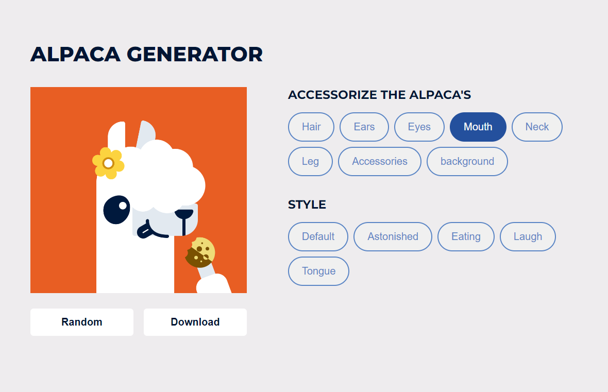

# DevProjects - Alpaca image generator website

This is an open source project from [DevProjects](http://www.codementor.io/projects). Feedback and questions are welcome!
Find the project requirements here: [Alpaca image generator website](https://www.codementor.io/projects/web/alpaca-image-generator-website-ce2oc0eus8)

## Tech/framework used
Built with HTML CSS & JavaScript

## Screenshots and demo

## Links

- Solution URL: [GitHub repo](https://github.com/nicknjagi/alpaca-image-generator-website)
- Live Site URL: [https://nicknjagi.github.io/alpaca-image-generator-website/](https://nicknjagi.github.io/alpaca-image-generator-website/)

## License
[MIT](https://choosealicense.com/licenses/mit/)
Most open source projects use the MIT license. Feel free to choose whichever license you prefer.
